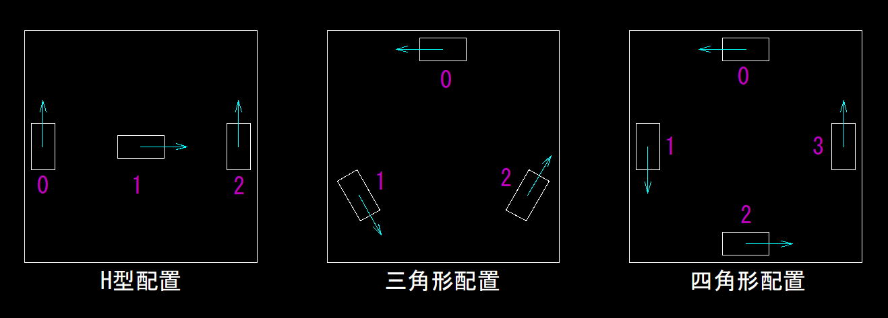

# CoordinateMeasurer

自己位置推定のためのライブラリ


## 計測輪の配置

数字：計測輪の番号  
矢印：正の方向  


## サンプルプログラム
詳細は [coordinate_measurer.hpp](..\coordinate_measurer.hpp) に書いてあるので、参照すること。
四角形配置の場合を記すが、三角形配置、H型配置の場合も同様

### コンストラクタ
引数：PPR, 計測輪半径, 取付半径, 計測輪自身の角度の配列
```C++
std::array<float,4> encoder_angle = {180, 270, 360, 90}; // 各エンコーダの角度
aca::CoordinateMeasurerSquare coordinate_measurer(
    1000, 30, 270, encoder_angle
    );
```

### 自由計測輪の場合のコンストラクタ(ここでは五角形を記している)      
引数：PPRの配列, 計測輪半径の配列, 取付半径の配列,  
計測輪自身の建前の角度の配列, 計測輪自身の本当の角度の配列 
```C++
std::array<uint16_t,5> encoder_CPR = {500, 1000, 500, 500, 1000};
std::array<uint16_t,5> radius_of_measure_wheel = {60, 30, 60, 60, 30};
std::array<uint16_t,5> radius_of_attachment = {500, 300, 500, 500, 300};
std::array<float,5> encoder_angle_Tcp = {180, 252, 324, 36, 108};
std::array<float,5> encoder_angle_true = {180, 250.4, 324.02, 36.5, 108};
aca::CoordinateMeasurerFreedom<5> coordinate_measurer(
    encoder_CPR, radius_of_measure_wheel, radius_of_attachment,
    encoder_angle_TCP, encoder_angle_true
    );
```

### 座標の更新と取得
```C++
std::array<int32_t,4> encoder_count; // 現在のエンコーダのカウント
coordinate_measurer.update(encoder_count);

aca::Coordinate coordinate;
coordinate = coordinate_measurer.get_coordinate();
```

### 座標の上書き
x方向はそのままで、y方向にキャリブレーションした場合
```C++
coordinate_measurer.overwriteCoordinate(
    aca::Coordinate{coordinate.x, 0, 0}
);
```

[<< 戻る](../README.md)