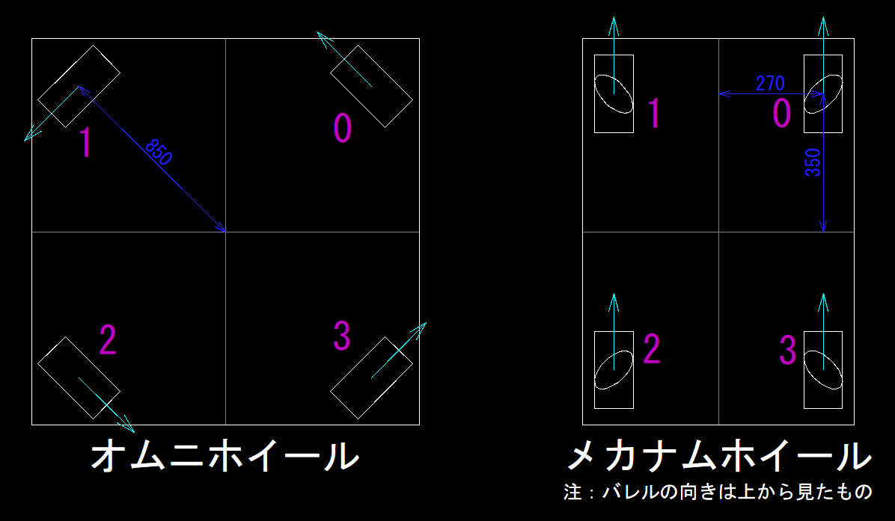

# WheelController

駆動のための、x,y,回転方向の速度を各ホイールの速度に変換するためのライブラリ

## 駆動輪の配置
サンプルプログラムの配置

ピンクの数字：駆動輪の番号  
矢印：正の方向  

## サンプルプログラム
詳細は [wheel_controller.hpp](..\wheel_controller.hpp) に書いてあるので、参照すること。

### コンストラクタ（オムニホイール）
```c++
constexpr robot_radius = 850;
aca::OmniWheelController<4, int16_t> omni_wheel_controller(
  std::array<MechanicParameter, 4>{
  	aca::MechanicParameter{ 3.0/4.0*M_PI, robot_radius},
  	aca::MechanicParameter{-3.0/4.0*M_PI, robot_radius},
  	aca::MechanicParameter{-1.0/4.0*M_PI, robot_radius},
  	aca::MechanicParameter{ 1.0/4.0*M_PI, robot_radius}
  }
);
```

### コンストラクタ（メカナムホイール）
```C++
aca::MecanumWheelController<int16_t> omni_wheel_controller(270, 350);
```

### 更新と取得
オムニホイールの場合でやるが、メカナムホイールの場合も同様
```c++
// 更新方法1
aca::field_velocity = {field_velocity_x, field_velocity_y, angular_velocity};
omniWheelController.update(field_velocity, angle);
// 更新方法2
omniWheelController.update(field_velocity_x, field_velocity_y, angular_velocity, angle);

// 取得方法1
std::array<int16_t,4> wheel_velocity;
wheel_velocity = omniWheelController.get_wheel_velocity();
// 取得方法2（非推奨）
std::array<int16_t,4> wheel_velocity;
for(uint8_t i=0; i++; i<4;){
  wheel_velocity[i] = omniWheelController.get_wheel_velocity(i);
}
```


## 目次
- [WheelController](#wheelcontroller)
  - [目次](#目次)
  - [クラステンプレート](#クラステンプレート)
  - [関数](#関数)
    - [WheelController::update(CoordinateSystem_3D<float>, float)](#wheelcontrollerupdatecoordinatesystem_3dfloat-float)
    - [WheelController::update(float, float, float, float)](#wheelcontrollerupdatefloat-float-float-float)
    - [WheelController::get_wheel_velocity()](#wheelcontrollerget_wheel_velocity)
    - [WheelController::get_wheel_velocity(uint8_t)](#wheelcontrollerget_wheel_velocityuint8_t)
- [OmniWheelController](#omniwheelcontroller)
  - [クラステンプレート](#クラステンプレート-1)
  - [コンストラクタ](#コンストラクタ)
    - [OmniWheelController::OmniWheel(std::array<MechanicParameter, NUMBER_OF_OMNI_WHEELS>)](#omniwheelcontrolleromniwheelstdarraymechanicparameter-number_of_omni_wheels)
- [MecanumWheelController](#mecanumwheelcontroller)
  - [クラステンプレート](#クラステンプレート-2)
  - [コンストラクタ](#コンストラクタ-1)
    - [MecanumWheelController::MecanumWheelController(float, float)](#mecanumwheelcontrollermecanumwheelcontrollerfloat-float)

## クラステンプレート
```c++
template <std::size_t NUMBER_OF_WHEELS, typename WHEEL_VELOCITY_TYPE>
```
```yaml
NUMBER_OF_OMNI_WHEELS: ホイールの数
WHEEL_VELOCITY_TYPE: 各ホイールの速度の型
```

## 関数

##### WheelController::update(CoordinateSystem_3D<float>, float)
> ```c++
> void update(
>   CoordinateSystem_3D<float> field_velocity,
>   float angle
> )
> ```
> 各ホイールの速度を更新します。
> ```c++
> // 例
> aca::field_velocity = {field_velocity_x, field_velocity_y, angular_velocity};
> omniWheelController.update(field_velocity, angle);
> ```

##### WheelController::update(float, float, float, float)
> ```c++
> void update(
>   float field_velocity_x,
>   float field_velocity_y,
>   float angular_velocity,
>   float angle
> )
> ```
> 各ホイールの速度を更新します。
> 内部で上記の update を実行しています。
> ```c++
> // 例
> omniWheelController.update(field_velocity_x, field_velocity_y, angular_velocity, angle);
> ```

##### WheelController::get_wheel_velocity()
> ```c++
> std::array<WHEEL_VELOCITY_TYPE, NUMBER_OF_OMNI_WHEELS> get_wheel_velocity()
> ```
> 各ホイールの速度を保持したarray配列を返します。
> ```c++
> // 例
> std::array<float,4> wheel_velocity;
> omniWheelController.get_wheel_velocity();
> ```

##### WheelController::get_wheel_velocity(uint8_t)
> ```c++
> WHEEL_VELOCITY_TYPE get_wheel_velocity(uint8_t wheel_number)
> ```
> 指定したホイールの速度を返します。
> ```c++
> // 例
> omniWheelController.get_wheel_velocity(0);
> ```


# OmniWheelController

オムニホイール駆動のため、WheelController を継承したライブラリ

## クラステンプレート
```c++
template <std::size_t NUMBER_OF_OMNI_WHEELS, typename WHEEL_VELOCITY_TYPE>
```
```yaml
NUMBER_OF_OMNI_WHEELS: オムニホイールの数
WHEEL_VELOCITY_TYPE: 各オムニホイールの速度の型
```

## コンストラクタ

##### OmniWheelController::OmniWheel(std::array<MechanicParameter, NUMBER_OF_OMNI_WHEELS>)
> ```c++
> OmniWheelController
> (
>   std::array<MechanicParameter, NUMBER_OF_OMNI_WHEELS> mechanic_parameter
> ) 
> ```
> オムニホイールの取り付け位置を設定します。
> ```c++
> // 例
> aca::OmniWheelController<4, int16_t> omni_wheel_controller(
>   std::array<MechanicParameter, 4>{
>   	aca::MechanicParameter{ 3.0/4.0*M_PI, robot_radius},
>   	aca::MechanicParameter{-3.0/4.0*M_PI, robot_radius},
>   	aca::MechanicParameter{-1.0/4.0*M_PI, robot_radius},
>   	aca::MechanicParameter{ 1.0/4.0*M_PI, robot_radius}
>   }
> );
> ```


# MecanumWheelController

メカナムホイール駆動のための、WheelController を継承したライブラリ

## クラステンプレート
```c++
template <typename WHEEL_VELOCITY_TYPE>
```
```yaml
WHEEL_VELOCITY_TYPE: 各メカナムホイールの速度の型
```

## コンストラクタ

##### MecanumWheelController::MecanumWheelController(float, float)
> ```c++
> MecanumWheelController
> (
>   float a,
>   float b
> ) 
> ```
> メカナムホイールの取り付け位置を設定します。  
> a: 左右のホイールの距離の半分  
> b: 前後のホイールの距離の半分  
> ```c++
> // 例
> aca::MecanumWheelController<int16_t> omni_wheel_controller(a, b);
> ```
